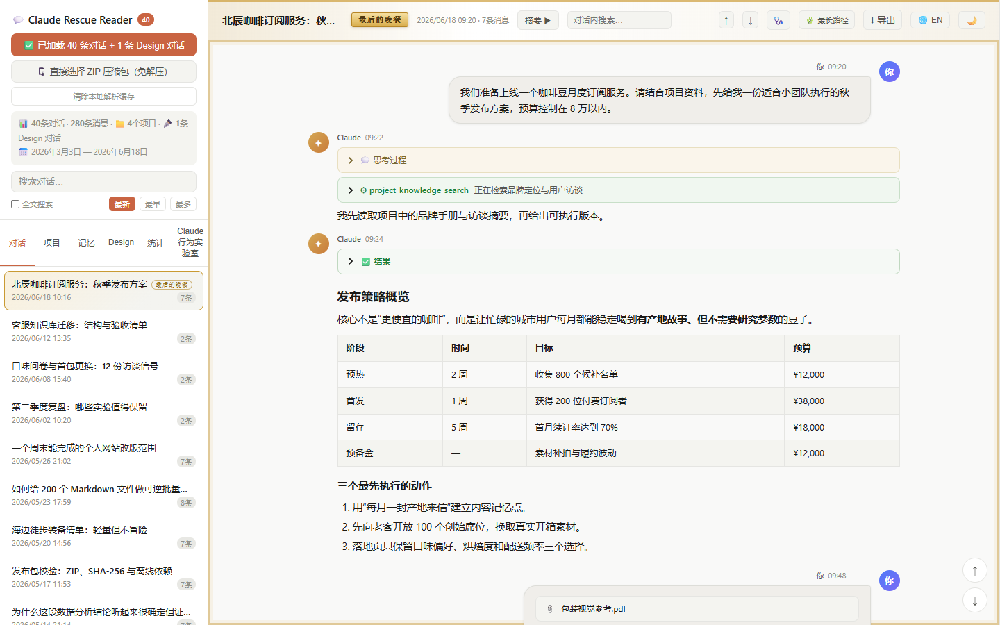
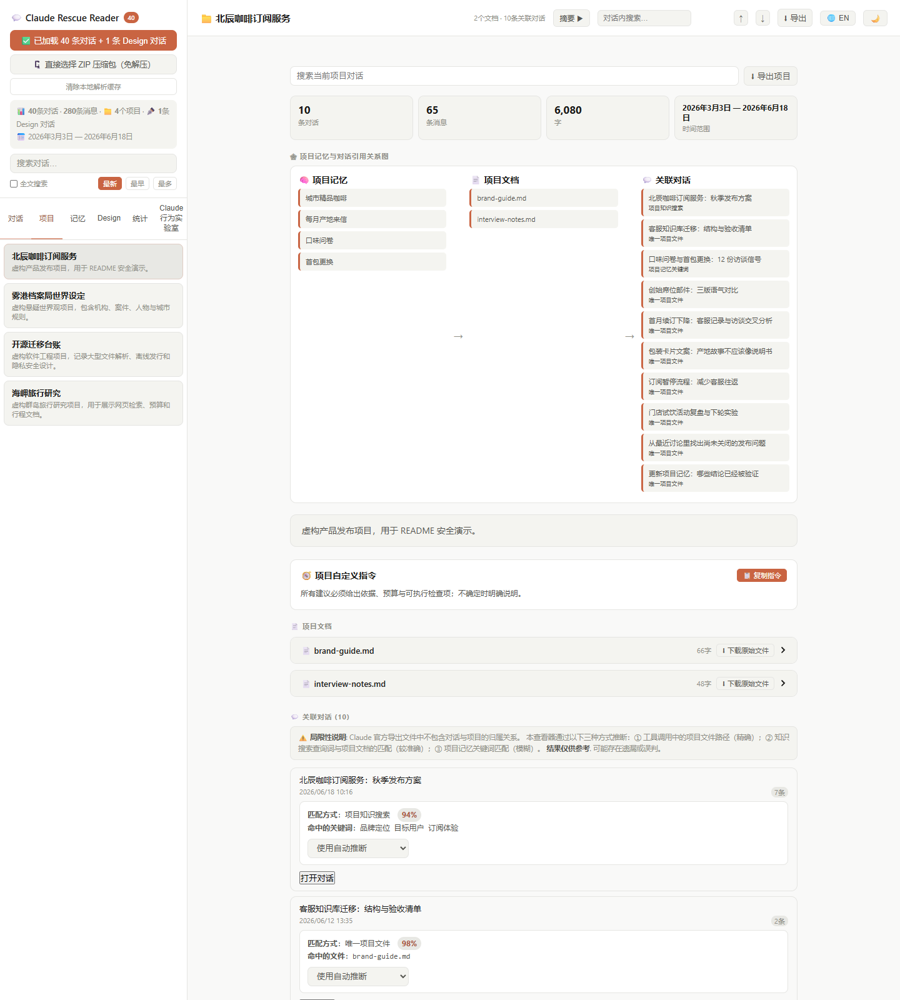
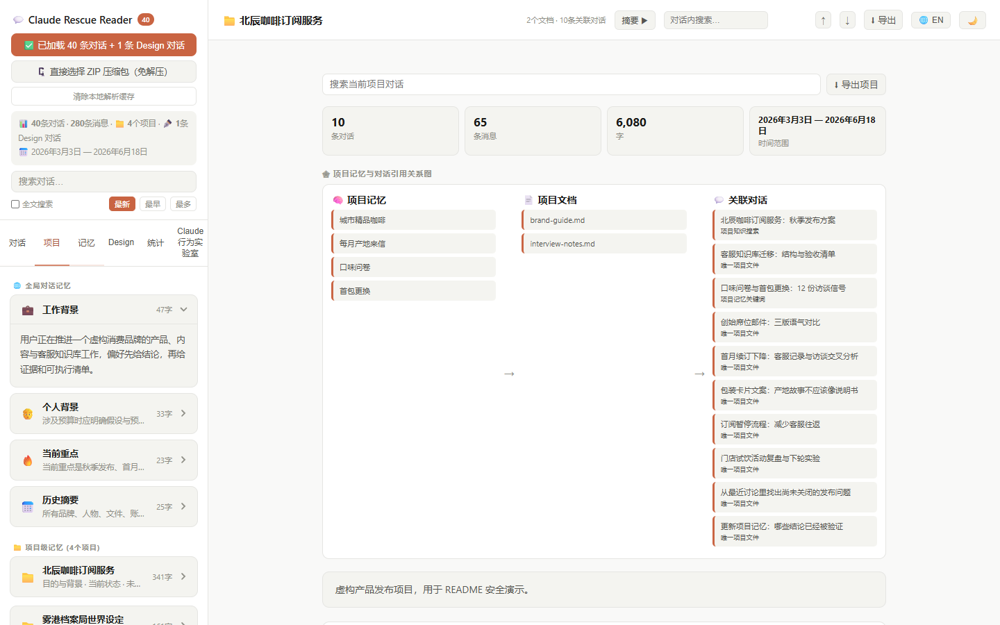

[中文](README.md) | [English](README.en.md)

# Claude Rescue Reader

**本地 Claude 导出历史查看器**

> **把 Claude 官方导出的 ZIP，变成可搜索、可分析、可安全分享的本地对话档案。**

无需安装 · 单文件打开 · ZIP 免解压 · 纯本地处理 · 支持大型历史

[](https://github.com/Artistkisa/claude-rescue-reader/releases/latest)
[](https://github.com/Artistkisa/claude-rescue-reader/actions/workflows/viewer-validation.yml)
[](https://github.com/Artistkisa/claude-rescue-reader/actions/workflows/browser-smoke.yml)
[](https://github.com/Artistkisa/claude-rescue-reader/actions/workflows/privacy-guard.yml)
[](https://github.com/Artistkisa/claude-rescue-reader/releases/latest)
[](LICENSE)

**[⬇ 直接下载 viewer.html](https://github.com/Artistkisa/claude-rescue-reader/releases/latest/download/viewer.html)** · **[🔌 下载完整离线版](https://github.com/Artistkisa/claude-rescue-reader/releases/latest/download/claude-rescue-reader-offline.zip)** · **[🧪 合成演示 ZIP](docs/demo/claude-rescue-reader-synthetic-demo.zip)** · **[🌐 English](README.en.md)**



<sub>截图使用“北辰咖啡订阅服务”虚构历史生成；人物、品牌、文件与数值均为合成演示数据。</sub>

---

## 30 秒开始

1. 从 Claude 下载官方数据导出 ZIP。
2. [直接下载 `viewer.html`](https://github.com/Artistkisa/claude-rescue-reader/releases/latest/download/viewer.html)，双击用浏览器打开。
3. 把 ZIP 拖进页面——**不用解压，不用上传，不用安装。**

也可以选择解压后的整个文件夹；Chrome、Edge 和 Firefox 均可使用。

| 你会得到 | 不只是“能打开” |
|---|---|
| 💬 **完整阅读** | Markdown、代码、Thinking、工具调用、Artifact、Design、附件和对话分支 |
| 🔎 **快速找回** | 标题/摘要搜索、全文搜索、对话内定位、项目级搜索 |
| 📊 **理解历史** | 活跃趋势、模型/工具分布、词频、最长对话、使用画像和健康报告 |
| 🧭 **重建项目** | 项目记忆、知识文件、关联证据、置信度、手动修正和引用关系图 |
| 🧪 **审计 Claude 行为** | 工具调用时间线、隐藏结果探针、Thinking 完整性和回答证据链 |
| 🛡️ **安全分享** | 敏感信息预览、标准/强力脱敏、SCP 黑条风格及安全 PDF/Markdown |

> 🔒 所有历史解析、搜索、统计和脱敏都在当前浏览器本地完成。查看器没有后端，也不会上传你的对话。


## 差异一眼可见

| 能力 | 文本编辑器 | 普通导出查看器 | Rescue Reader |
|---|:---:|:---:|:---:|
| 大型 ZIP 直读 | ❌ | 部分 | ✅ |
| 对话分支 | ❌ | 部分 | ✅ |
| 项目关联证据 | ❌ | ❌ | ✅ |
| 全局 / 项目记忆 | ❌ | 部分 | ✅ |
| Thinking 完整性 | ❌ | ❌ | ✅ |
| 工具结果来源与审计 | ❌ | ❌ | ✅ |
| Worker 懒解析 | ❌ | 部分 | ✅ |
| 导出前脱敏预览 | ❌ | ❌ | ✅ |
| 完全离线发行版 | — | 部分 | ✅ |

<sub>“普通导出查看器”指常见功能基线，不影射或点名任何项目；“部分”表示支持程度会随实现和导出结构变化。</sub>

## Claude 的导出 ZIP，远不只是聊天文本

Rescue Reader 会把普通聊天记录里不显眼的内容重新呈现出来：

- Claude 已生成、但网页端不一定突出展示的对话摘要
- 全局记忆、项目记忆、项目自定义指令与知识文件
- Thinking 的截断、隐藏、摘要、签名和替代展示状态
- 工具审批、MCP / 集成来源、调用参数、错误与隐藏结构化结果
- 项目知识搜索记录，以及它们为项目归属推断提供的证据
- 分支、孤儿消息、空记录、时间倒序与不完整附件
- 附件路径、内部元数据、flags，以及分享前值得检查的其他字段

这些字段只能证明“导出档案中存在相应记录”，**不能单独证明**账号被风控、模型被降级或后台采取了某种处置。

## 把导出里“有但不显眼”的关系重新拼回来

### 项目记忆 → 项目文件 → 关联对话

Claude 官方导出没有保存“这条对话属于哪个项目”的直接关系。本查看器不会只按标题硬分组，而是使用三层证据进行高置信度推断：

1. **唯一项目文件**：对话引用了仅属于某个项目的文件，置信度最高。
2. **项目知识搜索**：`project_knowledge_search` 的查询词与项目文档内容匹配。
3. **项目记忆关键词**：对话标题或官方摘要命中该项目独有记忆；平局和低信度结果保持未归属。

每条结果都会显示匹配方式、置信度、命中的文件/查询/记忆，并允许用户在本地手动修正。关系图进一步把项目记忆、知识文件和关联对话连成一条可检查的证据链。



<sub>这不是预设好的静态图片：截图中的 88% 项目知识匹配、98% 唯一文件匹配和项目记忆匹配，均由正式匹配代码对合成导出实时计算。</sub>

### 全局记忆、项目记忆与官方导出摘要

查看器会解析全局记忆的工作背景、个人背景、当前重点和历史摘要，也会按项目展示目的、状态、规划、经验、工作方式与资源。对话侧栏则直接显示导出中已有的 `summary` 和元数据——**不会联网，也不会重新调用模型生成摘要。**

<table>
<tr>
<td width="72%"></td>
<td width="28%"></td>
</tr>
<tr>
<td><b>全局记忆 + 项目级记忆</b></td>
<td><b>官方导出的对话摘要</b></td>
</tr>
</table>

<details>
<summary><b>账号被封了？这正是项目最初诞生的原因</b></summary>

Claude 账号受限后，通常仍可通过限制页面申请官方数据导出。收到 ZIP 后，即使无法再进入原来的聊天界面，也能用本工具在本地恢复阅读、搜索和导出。

所以，账号可能没了，但对话不必跟着消失。

</details>

---

## 为什么需要这个工具

Claude 的导出文件是这样的：

```json
[{"uuid": "3f8a1c2d-e947-4b6f-9d3e-72a5b8c1f0e4", "name": "\u67d0\u9879\u76ee\u7684\u6280\u672f\u8c03\u7814\u8bb0\u5f55", "summary": "**Conversation Overview**\n\nThis conversation focused entirely on technical research...", "chat_messages": [{"uuid":"01a2b3c4-d5e6-7f8a-9b0c-d1e2f3a4b5c6", "text":"...", "content": [{"start_timestamp":"2024-11-08T09:23:14.882341Z","stop_timestamp":"2024-11-08T09:23:17.103Z","flags":null,"type":"thinking","thinking":"Let me analyze the user's request..."}, {"type":"text","text":"...实际回答内容...","citations":[]}], "sender":"assistant", "parent_message_uuid":"00000000-0000-4000-8000-000000000000", ...}]}]
```

150MB，一行，无换行，中文全部 Unicode 转义（`\u67d0\u9879\u76ee` = 某项目），思考过程和正文混在同一个 `content` 数组里，对话树靠 `parent_message_uuid` 链接，项目文档是另一堆 JSON 文件，记忆是 Markdown 塞在 JSON 字符串里。

**直接用文本编辑器打开的结果**：VS Code 会弹出这个提示——

> **SHOW MORE (150MB)**
> Rendering paused for long line for performance reasons.
> This can be configured via `editor.stopRenderingLineAfter`.

然后拒绝渲染剩余内容。一行文字，150MB，把编辑器本身干沉默了。

这个工具把它变成可以正常阅读的对话界面。

## 使用场景

- 🔒 账号被封后，通过官方导出功能抢救历史数据
- 📦 整理和回顾自己的 Claude 对话记录
- 🔍 搜索、导出特定对话内容

## 完整使用说明

### 第一步：导出 Claude 数据

账号被封后，登录会直接跳转到 [claude.ai/restricted](https://claude.ai/restricted)。页面上有个按钮：

> **Export your data**
> We'll package up your conversations, projects, and settings for download. This might take some time to complete.

点它，等邮件，下载，解压。就这么简单——至少导出这件事他们做得还算人道。

<details>
<summary>顺便，官方 FAQ 的措辞也挺值得一读（点击展开）</summary>

**Q: Why was my account put on hold?**
> We put your account on hold because of unusual activity. We can't share the specifics—that would help bad actors get around the same checks.

翻译：我们不告诉你为什么封你，因为告诉你的话坏人就知道怎么绕过去了。至于你是不是坏人，那是另一回事。

**Q: How long will the review take?**
> Reviews take about 10 days.

十天。祝你在这十天里找到一个能聊天的替代品，虽然你大概找不到。

**Q: Will my billing be affected?**
> We cancelled your subscription and refunded your most recent payment in full.

这个确实做得不错，给退钱了。

**Q: What if I think this is a mistake?**
> Request a review and our team will look over your account. The more specific you are about what you were working on, the better.

所以你需要向 Anthropic 解释你在用 Claude 干什么，才能让他们判断你是不是坏人。希望你的世界观写作、代码调试或者闲聊记录足够自证清白。

</details>

导出文件夹结构如下：

```
claude-export/
├── conversations.json   # 所有对话（含完整消息）
├── users.json           # 账号信息
├── memories.json        # Claude 的记忆（全局 + 项目级）
└── projects/
    └── <uuid>.json      # 各项目文档
```

### 第二步：打开查看器

1. 下载 [`viewer.html`](viewer.html)，直接用浏览器打开（推荐 Chrome / Edge / Firefox）
2. 二选一加载数据：
   - 点击「🗜️ 直接选择 ZIP 压缩包」，选择邮件里下载的 ZIP（**免解压**）
   - 或点击「📂 选择导出文件夹」，选择手动解压后的整个文件夹
3. 等待加载完成（大文件约需数秒，150MB 约 3–5 秒）

> **注意**：需要网络连接以加载渲染依赖（来自 jsDelivr CDN）。离线使用请参考下方[离线模式](#离线模式)说明。

## 功能介绍

### 对话列表
- 按更新时间 / 创建时间 / 消息数排序
- 搜索对话标题和摘要，勾选「全文搜索」可搜索消息正文
- 支持对话内搜索、高亮结果并在命中项之间导航
- ↑ / ↓ 或 J / K 键盘导航

### 消息渲染
- Markdown 完整渲染（标题、表格、代码块、引用等）
- 代码块带语言标签 + 一键复制按钮
- 💭 **思考过程**（Thinking 块）可折叠展开
- ⚙ **工具调用** 和结果可折叠展开
- 支持编辑/重新生成形成的对话分支版本切换
- 支持 artifact、Mermaid 图表、生成文件、网页搜索面板、附件与搜索引用等富内容
- 当导出只保留图片文件名时，可从同时导入的目录/ZIP 自动补挂载图片，也可手动选择本地图片；已绑定图片会进入 PDF 渲染
- 单条消息可复制为纯文本

### 项目
- 查看项目文档（Markdown 渲染，可折叠）
- 独立展示并复制项目自定义指令，项目知识文件可逐个下载原始内容
- 高置信度推断关联对话：唯一文件证据 → 项目知识搜索 → 项目独有关键词
- 项目匹配解释面板：展示命中的记忆、文件、关键词和置信度
- 支持手动修正项目归属；确认结果仅保存在当前浏览器本地，不修改原始导出
- 项目级全文搜索、统计、Markdown 导出，以及项目记忆 → 文档 → 对话引用关系图
- **注**：Claude 官方导出不含项目-对话归属关系；重复文件名、匹配平局和低信度结果会保持未归属，避免强行误配

### 记忆
- 全局对话记忆按 4 个分区（工作/个人/重点/历史）展示
- 各项目记忆按 6 个标准分区展示，可折叠

### 统计
- 打开「统计」Tab 后才在持久 Data Worker 中计算，普通阅读不会预先扫描统计数据
- 展示对话、消息、角色、字符、Thinking、工具、附件与网页搜索总量
- 展示月度/星期/小时活跃度、对话深度、角色消息与字符分布、内容块构成、模型信息（导出包含时）与最长对话
- 在 Worker 内生成中英文高频词云，并汇总搜索、文件、Artifact 与 Thinking 数量
- 额外分析活跃天数/连续活跃、回复延迟、对话跨度、分支与替代消息、空消息等历史健康指标
- 生成本地“使用画像”和极值洞察：最活跃时段、深夜消息、连续活跃区间、最常用工具、最长 Thinking 与工具失败最多的对话
- 统计、词频、全文索引和项目匹配直接复用 Worker 内的原始记录，不再由主线程重复序列化全部消息；任何内容都不会上传

### 大型导出性能
- `conversations.json` 以 4 MiB 分块读取，并通过 Transferable `ArrayBuffer` 交给持久 Data Worker
- 初次导入只扫描顶层数组并返回标题、时间、摘要和消息数；打开某条对话时才解析该对话的完整消息
- 解析记录以文件大小、修改时间和首尾内容指纹隔离后缓存在本机 IndexedDB；来源变化时不会复用旧缓存
- 缓存始终留在当前浏览器，可通过侧栏的「清除本地解析缓存」随时删除
- 代码高亮、Mermaid、Artifact iframe 和 ZIP 解析按实际功能/视口加载，不阻塞初始对话列表

#### 可复现的 CPU 限速基准

| 合成 `conversations.json` | CPU 限速 | 初始列表 | 打开 100 条消息对话 | 全文搜索 |
|---:|---:|---:|---:|---:|
| 50 MiB | 4× | 0.55 秒 | 0.65 秒 | 0.04 秒 |
| 150 MiB | 6× | 1.69 秒 | 0.90 秒 | 0.10 秒 |
| 300 MiB | 6× | 3.19 秒 | 1.02 秒 | 0.23 秒 |

结果取 3 次全新浏览器运行的中位数，使用 Chromium `150.0.7871.187`、Playwright `1.62.0`，并在导入前通过 CDP 设置 CPU 限速。每份文件都由脚本在本地生成到精确体积，只含虚构 ASCII 对话；每条完整记录包含 100 条人类 / Claude 交替消息，搜索使用统一的合成标记词。测试不会读取或公布真实历史、真实标题、本地路径、账号数据或硬件型号。

运行 `npm run benchmark:readme` 即可复现；[基准脚本](scripts/benchmark-readme-performance.mjs)和[原始报告](docs/benchmarks/readme-performance.json)与表格一同提交。数字用于说明不同体积下的相对表现，不承诺所有磁盘、浏览器、导出结构和散热状态都得到相同结果。大型单行 Claude 导出让编辑器或普通页面卡顿，是社区反复出现的实际痛点；[这条 ClaudeAI 讨论](https://www.reddit.com/r/ClaudeAI/comments/1oee39d/built_a_tool_to_view_claude_conversation_exports/)就是一个公开案例。

### 其他
- 🌙 / ☀️ 明暗主题切换，偏好自动保存
- ⬇ **导出**：将当前对话导出为 Markdown（Ctrl/Cmd+E）或 PDF
- PDF 复用阅读器的完整消息渲染，保留代码、Artifact、思考/工具面板与分支结构警告
- Artifact 可导出为 PNG；SVG、Mermaid 与静态 HTML 会内联计算样式，失败时回退下载原始源码
- 自动探测并单独分类 Claude Design 导出，不会混入普通对话或统计数据
- 对话区右侧提供快速回到顶部/底部的悬浮按钮

## 键盘快捷键

| 快捷键 | 功能 |
|--------|------|
| ↑ / K  | 上一条对话 |
| ↓ / J  | 下一条对话 |
| Ctrl+E | 导出当前对话为 Markdown |

## 离线模式

从 GitHub Release 下载 `claude-rescue-reader-offline.zip`，解压后直接打开其中的 `viewer.html`。请保持 `vendor/` 文件夹与 `viewer.html` 位于同一目录；Markdown、ZIP、代码高亮和 Mermaid 依赖均已包含，无需联网。

普通的 `viewer.html` 仍保持单文件发行方式，适合联网环境或只需要基础浏览的场景。历史 Artifact 自身写死的外部资源不属于查看器依赖，离线时仍可能不可用。

如需手动制作离线版，也可以在 `viewer.html` 同目录下放置以下文件并修改引用路径：

```
marked.min.js          ← https://cdn.jsdelivr.net/npm/marked/marked.min.js
highlight.min.js       ← https://cdn.jsdelivr.net/gh/highlightjs/cdn-release@11.11.1/build/highlight.min.js
jszip.min.js           ← https://cdn.jsdelivr.net/npm/jszip@3.10.1/dist/jszip.min.js
mermaid.min.js         ← https://cdn.jsdelivr.net/npm/mermaid@11.16.0/dist/mermaid.min.js
github.min.css         ← https://cdn.jsdelivr.net/npm/highlight.js@11.11.1/styles/github.min.css
github-dark.min.css    ← https://cdn.jsdelivr.net/npm/highlight.js@11.11.1/styles/github-dark.min.css
```

## 隐私与安全

- ✅ 纯本地运行，无后端，无埋点，无任何网络请求（CDN 除外）
- ✅ 数据不会被上传或分享
- ✅ 浏览器关闭后，除主题和界面语言偏好外不保留任何数据（`localStorage` 仅存 `cv-theme` / `cv-lang`）
- ✅ 安全导出展示命中类型、遮罩预览、位置和匹配原因，不在预览中暴露完整敏感值
- ✅ 可选强力隐私过滤会进一步处理姓名、学校/单位、详细地址、证件、UID、社媒账号和链接，并明确提示可能误伤
- ✅ SCP 档案模式使用黑条与 `[数据删除]`，PDF 额外带有 `CONFIDENTIAL` 水印和保密徽章
- ⚠️ 导出的 JSON 文件包含您的完整对话历史，请妥善保管

## 已知限制

- 导出文件不含图片二进制内容，仅显示占位符
- 依赖脚本运行或 Canvas 动态绘制的交互式 HTML Artifact，PNG 导出可能只保留其静态结构；此时可使用自动回退的原始源码
- 对话树默认展示最长路径；遇到编辑或重新生成的分支时，可在消息旁切换版本
- 项目与对话的归属关系为高置信度推断结果，非官方数据；为避免误配，低信度对话会保持未归属
- 超大对话（本工具测试数据：300+ 条对话 / 150MB+ / 单条最长 600+ 条消息）在低内存设备上可能加载缓慢
- 账号无项目或无记忆时，对应 Tab 会自动隐藏，不显示错误

## 数据结构说明

本工具解析的 Claude 导出格式（截至 2026 年）：

| 文件 | 内容 |
|------|------|
| `conversations.json` | 全部对话，含完整消息树、`content` 块（text/thinking/tool_use/tool_result）、附件 |
| `memories.json` | 全局记忆 + 项目记忆，Markdown 格式，按 section 分区 |
| `projects/<uuid>.json` | 项目元数据 + docs 文档内容 |

**注**：Claude 官方导出不包含「对话属于哪个项目」的字段。本工具通过三层推断补全此关联，详见项目页说明。

## 技术栈

- 纯原生 HTML + CSS + JavaScript，发布产物仍是可直接打开的单文件，无框架依赖
- [marked.js](https://marked.js.org/) — Markdown 渲染
- [highlight.js](https://highlightjs.org/) — 代码语法高亮
- [JSZip](https://stuk.github.io/jszip/) — ZIP 压缩包直读（免解压）

持久数据管线与兼容性统计 Worker 的可维护源码分别位于 `src/data-worker.js` 和 `src/analytics-worker.js`。修改后运行 `scripts/build-single-file.ps1`，即可重新内联到 `viewer.html`；普通用户不需要运行构建脚本。

## Changelog

**v1.4** *(2026-07-30)*
- 增强图片补挂载、项目自定义指令、项目文件下载和更完整的统计洞察
- 安全导出新增可解释命中细则：遮罩预览、位置、类型与匹配原因
- 新增强力隐私过滤，覆盖姓名、学校/单位、地址、证件、UID、社媒账号和链接，并明确提示可能误伤
- SCP 档案模式新增 `CONFIDENTIAL` 水印、保密徽章与更完整的黑条导出样式
- 扩充成熟账号形态的纯合成演示 ZIP，并加入 20 秒端到端工作流 GIF
- 新增 50 / 150 / 300 MiB 可复现 CPU 限速性能基准及原始报告
- 产品名统一为 Claude Rescue Reader，下载入口改为最新 Release 资产直链

**v1.3** *(2026-07-29)*
- 新增 Claude 行为实验室：工具调用审计、隐藏结果探针、Thinking 完整性和回答证据链报告
- 大型历史解析、全文搜索、统计、项目匹配和行为分析复用持久 Data Worker，减少主线程对象复制与卡顿
- 新增项目关联解释、手动归属修正、项目级搜索/统计/导出及记忆引用关系图
- 新增预打包离线发行版，内含固定版本的 Markdown、ZIP、代码高亮和 Mermaid 依赖
- 普通单文件版与离线 ZIP 同时发布，并提供 SHA-256 校验文件

**v1.2** *(2026-07-28)*
- 新增 ZIP 直读和拖拽加载，兼容顶层目录、散落 JSON 文件及 macOS `__MACOSX` 条目
- 新增对话分支版本切换、对话内搜索导航、单条消息纯文本复制
- 新增 artifact、Mermaid、生成文件卡片和网页搜索结果等富内容渲染
- 修复孤儿消息丢失、artifact 主题异常、SVG 外部资源与沙箱安全问题
- 修复 `file://` 模式下语法高亮加载失败，并安全处理 Markdown 原始 HTML
- 大型历史记录改为渐进式消息渲染、延迟富内容渲染和页面缓存，降低首屏阻塞
- 项目关系索引改为后台分批构建，并加入失败恢复与竞态保护
- 项目归属推断改为高精度优先：使用唯一文件证据、项目知识和独有关键词，拒绝平局与低信度匹配

**v1.1** *(2026-07-17)*
- **修复：对话消息数量不对**（如显示 3 条，实际有 7 条）
  根本原因：对话树遍历时固定取"最后一个子节点"，在有分支时会走进空消息的死胡同。改为递归选择**最长路径**，并在等长时优先选有内容的分支。
- **修复：部分消息显示为"(空消息)"**
  Claude 导出的 `files` 数组中，`file_name` 字段有时为空字符串。现在回退到 `file_type` → `file_uuid` 兜底，确保附件气泡有内容显示，而不是空白或占位符。
- **修复：代码块显示 `[object Object]`**
  marked.js v5+ 将 `renderer.code` 的参数从 `(code, lang)` 改为传 token 对象，`String(code)` 因此变成 `[object Object]`。现在兼容新旧两种签名。
- **修复：点击对话无反应**
  事件绑定时 `forEach(el => ...)` 的回调参数 `el` 遮蔽了外层同名变量，导致 `el.dataset.convUuid` 读到容器本身（无此属性）。将回调参数改名为 `item` 解决。
- **修复："最早"排序与"最新"排序结果几乎一致**
  "最早"误用了降序（`b - a`），改为升序（`a - b`），现在最老的对话排最前。
- 新增全文搜索、排序按钮、统计面板、Markdown 导出、键盘导航
- 新增暗色/亮色主题适配（含思考块、工具调用块等所有颜色变量化）
- 新增移动端响应式布局（≤640px 侧边栏转顶部）
- 项目关联对话改为三层推断：文件路径精确匹配 → PKS 查询词匹配 → 关键词模糊匹配

**v1.0** *(2026-07-16)*
- 初始版本：加载 Claude 导出文件夹，渲染对话列表与消息内容

## License

MIT
